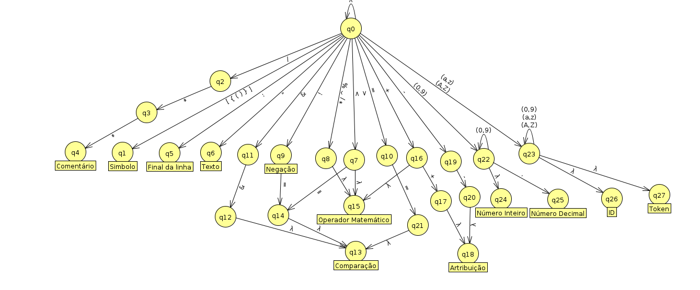
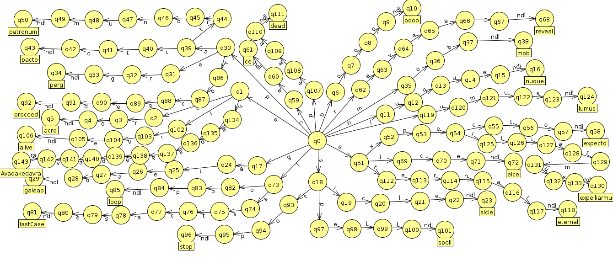

# Analisador Lexico
Trabalho de conclusão da disciplina de Compiladores (CCP154GP).

## Guia

- [Sobre](#sobre)
- [Documentation](#documentation)

## Sobre:
Projeto de conclusão do curso de compiladores, se trata de um analisador léxico da linguagem Hpl(Harry Potter Language), uma linguagem de programação que possui seus tokens / palavras reservadas baseadas no universo de Harry Potter.

[Leia a Documentação](https://great-cotton-8c1.notion.site/Analisador-L-xico-b9a46962e14e48f4aeecb03519c80fdd)

## Documentation:

## :settings: To update:
```bash
npm run dev
```

## :rocket: To run 
```bash
node dist/index.js
```

## :list: Lista de palavras reservadas
```txt
'booo' | 'nuque' | 'sicle' |  'galeao' | 'perg' | 'mob' | 'acro' | 'Pacto' | 
'Expecto' |  'Patronum' | 'reveal' | 'ce' | 'elce' | 'lastCase' | 'loop' | 
'turnstime' | 'stop' | 'proceed' | 'spell' | 'expelliarmus' | 'AvadaKedavra' | 
'alive' | 'dead' | 'temporary' | 'eternal' | 'lumus' | 'truth'
```

## :computer: Autômatos:
Autômatos de tokens:


Autômatos de palavras reservadas:


## Feito com :love: com:
- [TypeScript](https://www.typescriptlang.org/docs/)
- [Tsup](https://github.com/egoist/tsup)
- [NodeJs](https://nodejs.org/en)


[Filipe Santos on Linkedin](https://www.linkedin.com/in/filipemarquesdeveloper/)
